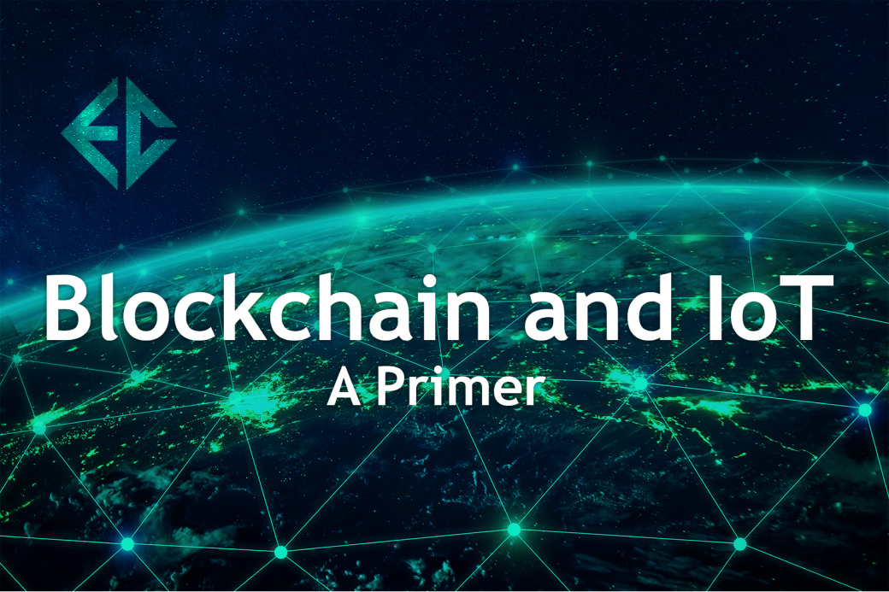
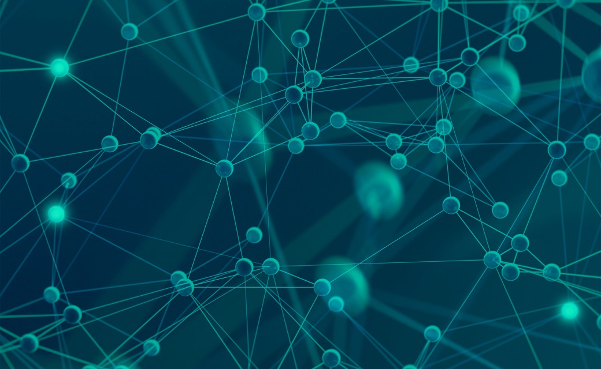
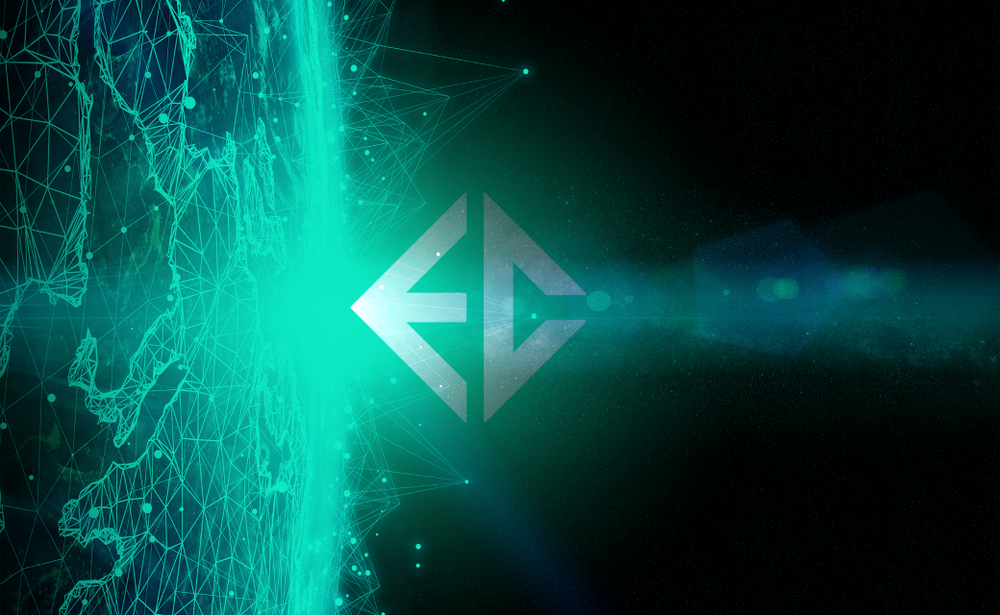

      

        

          

            <h1 class="article-blog__title-h1">
              Blockchain and IoT: A Primer
            </h1>
            
12 September, 2020

          

        

      

    

    

      

        

          

            
          

          

            Blockchain Ecosystems have emerged as a promising innovation to affirm the integrity of data shared among
            constituents in multiparty processes. Compared to traditional databases, blockchains are robust,
            decentralized, and tamper-proof, (meaning once a transaction occurs, it cannot be edited or hidden), and
            they require no central governing authority (since blockchain transactions are validated collectively by a
            network of node operators).
          

          

            In tandem to the rise of blockchain, the Internet of Things (IoT) has emerged as a method for collecting
            data from the physical world so as to streamline industrial business processes and product management across
            industries. IoT networks are networks of interconnected devices and intelligent objects that ultimately
            integrate data flows from the physical world, increase efficiency for decision makers, and ultimately cut
            overhead costs related to labor, time, and security measures. Smart devices cut out the middle-man by
            directly inputting and reading data that would otherwise have required a human intermediary - or simply
            could not have been collected at all. Business managers and industrial solutions providers are able to gain
            a holistic view of their environment in a passive yet reliable manner.
          

        

      

    

    

      

        

          <h2 class="article-blog-main-title-h2">
            Integrating Blockchain and IoT
          </h2>
          
          

            The advantages of integrating Blockchain and IoT cannot be overstated: Businesses with integrated IoT will
            have the ability to exploit new sources of revenue, data, and insights, while also cutting costs. In
            context, this new frontier of opportunity is only just beginning: By 2025, it is estimated that more than
            100 billion IoT connected devices are predicted to be actively deployed, generating an overall revenue of
            close to
             $10 trillion 
            US dollars.
          

          

            Perhaps most importantly, the combination of blockchain with IoT has the potential to vastly improve
            customer experience and trust between networks of stakeholders: Now, new data can not only be collected, but
            also shared, tokenized, and stored in a secure and transparent fashion.
          

        

      

    

    

      

        

          <h3 class="article-blog-main-title-h2">
            What Blockchain and IoT Can Offer:
          </h3>
          

            IoT is positioned to solve the problem of digitization in the logistics industry. Today’s
            logistics-dependent businesses are limited by their inability to collect and effectively utilize diverse
            data streams within their systems of production. Traditional logistics companies are plagued by
            underutilization of assets due to old and inefficient manual processes. Smart sensors can be outfitted to
            solve this problem by collecting data on anything that can be measured, from temperature to facial
            recognition. The information gathered by each sensor is validated by nodes on a sidechain, which records
            possession of the device to each individual sensor and subsequent location. In concert with blockchain
            technology, all of this data can be digitized and stored on a secure side-chain network. This data can then
            be shared with multiple parties in real-time, allowing businesses to increase productivity through greater
            knowledge and faster communication regarding their production and distribution systems.
          

          
          

            Smart contracts and tokenization allow for new business models surrounding that data, as well as new levels
            of specificity in how products are managed. A block-chain enabled IoT system will improve network integrity
            and security by allowing individual devices to register and validate themselves against the network. Smart
            contracts allow company operations to execute automatically. The decentralized nature of a system of smart
            contracts leaves no central authority to be attacked by bad actors, keeping businesses safe from threats
            like denial of service attacks or the alteration of key data.
          

          

            In the near future, integrating blockchain and IoT with other emerging technologies like artificial
            intelligence and machine learning holds the promise of ushering in new sources of revenue for businesses.
            Incorporating IoT and blockchain provides a physical-digital foundation for fully autonomous and intelligent
            objects of the future. Autonomous systems capable of sensing and reacting to their environment at light
            speed will become the basis of global supply chains. Agents in this platform will draw upon IoT data and
            machine learning models to identify and choose suppliers, procure input goods and efficiently respond to
            unplanned events. The combined environment opens the door to fully autonomous systems from the source of
            data to the end point of delivery.
          

        

      

    

    

      

        

          <h3 class="article-blog-main-title-h2">
            Introducing Emerald Circuit:
          </h3>
          

            Emerald Circuit is a cryptocurrency-based sidechain network that offers data security services for the
            combined environment in tandem with its proprietary selection of intelligent objects. From point of
            collection to hashing on the blockchain, Emerald Circuit collects, connects, and secures data using 128-bit
            encryption. As one of the first fully encrypted IoT to blockchain data networks, Emerald Circuit aspires to
            pioneer a new era of interconnectivity and data management with security as a top priority.
          

          
          

            On the brink of the fourth industrial revolution, the world stands on the brink of a tremendous paradigm
            shift: The rise of independent, autonomous, and artificially intelligent technologies. Anticipating this
            paradigm shift, Emerald Circuit aspires to be at the forefront of industrial digitization initiatives of
            objects used for security purposes. Emerald Circuit’s network of patented smart technology is laying the
            foundation for a global economy that derives higher profitability and consumer satisfaction from the
            integration of artificial intelligence and machine learning into its intelligent objects - with the prospect
            of further integration with biotechnology and nanotechnology in the future. The ultimate goal of these
            technological advancements is to bring about a future that is more fluid, intelligent, and malleable for
            diverse business needs and innovative business solutions. Building that future, starts here.
          

        

      

    
