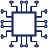

      

        

          

            <h1 class="article-blog__title-h1">
              The Internet of Things and Emerald
              Circuit:
            </h1>
            

              The Next Generation Of Intelligent Objects
              Has
              Arrived
            

            
12 September, 2020

          

        

      

    

    

      

        

          

            
          

          

            Businesses around the world are in the midst of two technological innovations that must be brought
            together to
            realize their full potential: The first, the “Internet of Things,” (or IoT) revolution is changing
            our relationship to product distribution and business analytics as more and more products take on
            “smart” characteristics and enter into new networks of connectivity. IoT enables the monitoring and
            management
            of physical things to improve and support situational awareness and business process execution. The
            second,
            is blockchain, which provides businesses with immutable data management within their networks. Both of
            these developments promise to increase efficiency, cut redundancies, and provide company-wide
            connectivity
            like never before, all surrounding a new core commodity: Data.
          

          

            Historically, IoT devices and communication protocols have varied
            widely by production system in terms of
            both reliability and security. This poses a problem to the security of an otherwise secure blockchain
            network.
            Known as the ‘Garbage-in, Garbage-Out problem’ IoT devices threaten to delegitimize the security and
            immutability provided by blockchain networks: While blockchain’s security benefits are
            well known
            , the
            original data entry must be made in good faith to protect the integrity of the data that is stored and
            shared
            amongst parties. In other words, the security of a blockchain is only as solid as its input data.
          

          

            There are two concerns when it comes to IoT security. First, if bad
            actors wish, they can hijack IoT readers and scanners. This can be done via product spoofing in the form
            of
            ID
            replacement, encryption key replacement, and the retransmission of older intercepted data as well as
            through
            malicious and authorized attacks on devices (i.e. the modification of the time stamped data). From
            smartphones
            to smart homes, every IoT device has the potential to be hacked. Hackers who gain access to IoT will be
            able
            alter data, access other devices on the network, and potentially infect much larger networks with
            viruses
            and
            malware.
          

          

            In context, Cybersecurity is the greatest threat to IoT implementation.
            In 2019, cyberattacks on IoT devices
            surged 300%
            , totaling over 2.9 billion hacking events. These
            attacks
            can
            be attributed to the fact that over
            98 percent
            of IoT traffic is unencrypted, making over half of all
            IoT
            devices vulnerable to medium- to high-severity attacks. These security breaches represent a significant
            financial cost and legal threat to companies operating within data protection and security regulations
            (GDPR).
            Though most security breaches make it to the headlines in the form of embarrassing leaks to private
            data,
            hackers are already using IoT breaches to access and exploit
            company-wide data systems
            for malicious
            ends.
          

        

      

    

    

      

        

          <h2 class="article-blog-main-title-h2">
            Emerald Circuit: Intelligent Objects For Guaranteed Product
            Authenticity
          </h2>
          
          

            Emerald Circuit is a cryptocurrency-based sidechain network focused
            exclusively on secure data collection and management using proprietary intelligent objects. From the
            initial
            point of collection until it is hashed onto the blockchain, Emerald Circuit collects, connects, and
            secures
            all data in order to guarantee authenticity, increase efficiency, and provide the first fully encrypted
            and
            cost-efficient foundation for any network of smart objects.
          

          

            Emerald Circuit is a protocol-layer network of secure intelligent
            objects connected to a side-chain infrastructure of the Ambrosus blockchain ecosystem. From the secure
            management of a single product, to an intelligent container, to the networked management of smart
            pallets,
            Emerald Circuit provides secure data flows from sensor to blockchain. Symbolic of the next-generation of
            IoT
            solutions, Emerald Circuit arrives as a first-mover in creating fully-secured, autonomous, and networked
            devices.
          

        

      

    

    

      

        

          

            <h2 class="article-blog-main-title-h2">
              Security IoT data collection through sidechain
              connectivity
            </h2>
            

              Blockchain is the
              recognized solution
              to IoT’s
              cybersecurity problem. Built upon a fully developed and
              operable blockchain infrastructure, Emerald Circuit focuses on the physical collection of data using
              128-bit encryption, and patented IoT technology to both collect and transmit such secure data. Original
              side-chain networking provides data security and management as well as anti-tampering and
              anti-counterfeiting services. In the context of the Emerald Circuit sidechain and the Ambrosus
              blockchain, Emerald Circuit’s network begins when the smart container’s sensors collect data from the
              product environment. This data is immediately encrypted transmitted to the Emerald Circuit sidechain.
              Next, after creating proof of data security on the sidechain, the remaining data is pushed to a Hermes
              Masternode on the Ambrosus Network. The data is then condensed and hashed onto the larger Ambrosus
              blockchain.
            

            

              

                

                  

                    
                  

                  

                    
EC Smart Conteiner

                  

                

              

              

                
              

              

                

                  

                    
                  

                  

                    
EC NET-SIDEchain

                  

                

              

              

                
              

              

                

                  

                    
                  

                  

                    
Hermes masternode

                  

                

              

              

                
              

              

                

                  

                    
                  

                  

                    
Abrosus blockchain

                  

                

              

            

            <h3 class="article-blog-main-title-h3">A Conclusion in Context:</h3>
            

              Industrial revolutions are defined by huge jumps in productivity
              due to advances in mechanisation. The modern economy has benefited from three such revolutions so far;
              the invention of the steam engine in the late 18th century, the introduction of electricity and assembly
              lines in the 19th century, and the development of microchips and computers in the mid-to-late 20th
              century. Advances in smart technology will usher in a fourth industrial revolution, in which large-scale
              machine-to-machine communication (M2M) and IoT are integrated for increased automation and efficiency.
              “Industrie 4.0” companies will benefit from improved communication and self-monitoring via the
              production of smart machines that can analyze and diagnose issues without the need for human
              intervention.
            

            
            

              Photo by
               Marc-Olivier Jodoin 
              on
               Unsplash
            

            

              The 21st century will be one of smart machines at each level of
              production. The products of the future and the security processes involved in protecting them will be
              managed by integrated networks of smart devices that can securely relay information in real-time.
              Emerald Circuit’s network of secured smart devices is positioned to lead the charge into the fourth
              industrial revolution, and in doing so, usher in unprecedented opportunity for product security and
              reliable business connectivity.
            

          

        

      

    
