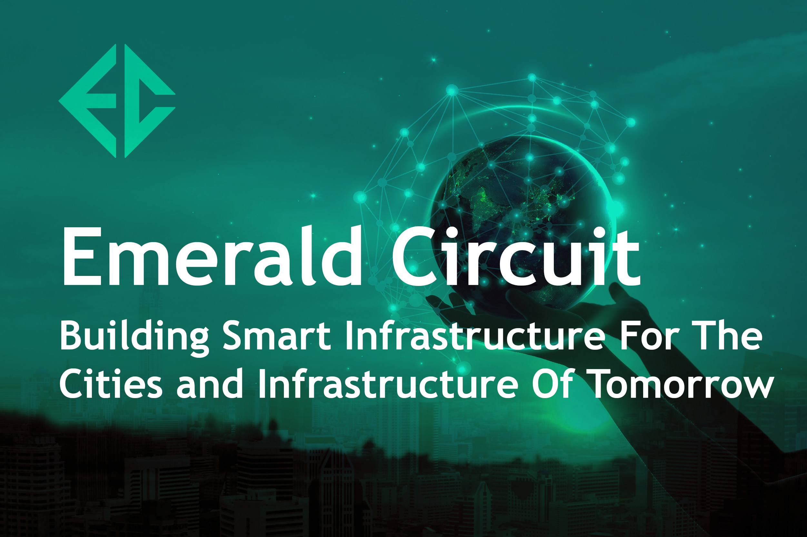

      

        

          

            <h1 class="article-blog__title-h1">
              Emerald Circuit: Building Smart Infrastructure For The Cities and Infrastructure Of Tomorrow.
            </h1>
            

              Introduction: The Coming Revolution in Blockchain and the Internet of Things:
            

            
8 October, 2020

          

        

      

    

    

      

        

          

            
          

          

            The combined IoT/blockchain environment is enabling developments in artificial intelligence and machine learning that promise to revolutionize the human relationship to the spaces and environments they inhabit.  This revolution is happening rapidly, with an estimated 127 new IoT devices added to smart networks throughout the world each second.  As of 2019, there were an estimated 26.6 billion active IoT devices, with 2025 estimates reaching as high as 75 billion.  IoT devices in the form of smart phones, smart homes, and even smart doorbells, have become an integral piece of the human landscape.  Notably, the security of these devices is of the utmost importance to stakeholders hoping to effectively utilize these ever-growing data streams.
          

          

            As cities and industrial management processes plan to innovate for the future, the most important general purpose technology since the steam engine comes to focus: Blockchain.  Blockchain’s distributed ledger is the most secure means for storing and managing big data gathered from off-the-shelf IoT devices or specially encrypted sensors. Increasingly, businesses are finding blockchain a fundamental component of their physical data management schemes.  Businesses, cities, governments, and other entities, can use IoT sensors at any point of the blockchain, to measure variables from air quality to temperature to turbulence.
          

          

            Businesses or municipalities that are invested in enterprises concerned with the quality assurance of commodities, such as crop shipments or rail cargo, will benefit from the fully-encrypted IoT to blockchain environment alongside cities looking to develop a more robust monitoring infrastructure for the data parameters of their environment.
          

        

      

    

    

      

        

          <h2 class="article-blog-main-title-h2">
            IoT Cybersecurity and The Problem of Garbage-In Garbage-Out:
          </h2>
          
          

            Like all rapid technological advances, IoT has proliferated faster than security measures can keep up.  These largely unsecured devices are now a treasure trove for bad actors looking to steal information or input fraudulent data into enterprise systems.  As a result of these threats, businesses and municipalities looking to utilize IoT data must invest in anti-counterfeiting and product security.  A recent study by Palo Alto Networks found that over 98% of IoT traffic is unencrypted, and therefore categorized as ‘vulnerable’ to cyber security attacks.  This not only poses an issue for a company’s enterprise security, but also for any larger blockchain infrastructure that the company may be connected with. After all, a distributed ledger is only as sound as its input data.
          

          

            In context, the problem of Garbage-in Garbage-out can be summarized in the following manner: If IoT-generated data entering into a blockchain is unsecured, the validity of all of the immutable data uploaded onto the blockchain is thrown into question.  Blockchain infrastructures cannot make any veracity guarantees for data that was not natively generated on-chain, which unfortunately makes up for the vast majority of the data coming in from IoT devices.  Hence, if a person (or a device) commits fraudulent data into the blockchain, there’s no way to ascertain the veracity of this data.  In effect, fraudulent data can, via unsecured IoT devices, be permanently committed to the blockchain’s history: Put simply, if you put garbage onto the blockchain, you get garbage out of the blockchain.
          

        

      

    

    

    

      

        

          <h2 class="article-blog-main-title-h2">
            Smart Cities: The Start of a New Urban Era?
          </h2>
          
          

            In the context of real-world adoption and development of emerging technologies, the combined IoT-blockchain innovation nexus has already caught the attention of city planners, who realize that the emergence of real-time data on everything from traffic control to weather monitoring and environmental conditions, can be a boon for social and economic goods.  
          

          

            In a nutshell, a smart city is an urban area that is able to make use of IoT sensors to collect and analyze data.  A smart city uses IoT data to manage city assets, coordinate municipal services, and identify resource inefficiencies.  Data can be collected from any IoT-enabled device, from smartphones to buildings to automobiles.  A smart city can manage traffic flow, energy plants, utilities, and waste collection via real-time, on-the-ground data inputs from smart devices.  Looking forward, cities can use artificial intelligence na dmachine learning to anticipate and mitigate crime in high risk areas, optimize hospital triage services, and even organize community events.
          

           

            Ultimately, a smart city that integrated distributed ledger technology, is able to reduce systems overhead by implementing smart contracts that automatically trigger tasks that would formerly require human oversight and execution.  As with all IoT-based innovations, the limiting factor for smart city development is security: With entire cities depending on such data infrastructure, it is of the utmost importance that such data is secure, and protecting from potential cyberattacks.
          

        

      

    

    

      

        

          <h2 class="article-blog-main-title-h2">
            Emerald Circuit: Secure Data From Endpoint to Blockchain
          </h2>
          
          

            Emerald Circuit, the first IEO on the Ambrosus network, solves the IoT/blockchain security gap via 128-bit encrypted IoT devices built into its proprietary intelligent objects.  By creating a secure link between IoT and blockchain, Emerald Circuit eliminates the garbage in, garbage out problem and creates a foundation for the future of secure product management.  Altogether, the goal of Emerald Circuit is to operate as a secure foundation for data solutions of the fourth industrial revolution. Meanwhile, for the smart city revolution specifically, Emerald Circuit realizes the social and economic potential of the smart city revolution: Securing the IoT/blockchain data gap is vital to bringing about a future city-scape that is both more equitable and economically prosperous for citizens.  
          

        

      

    

